# Диаграммы для ВКР: AnimeAttire

Актуализировано по текущему состоянию репозитория на основе:
- `ORCHESTRATION_PLAN.txt`
- `backend/users/views.py`
- `backend/catalog/views.py`
- `backend/catalog/services.py`
- `backend/catalog/serializers.py`
- `frontend/components/account/account-page.tsx`
- `frontend/components/product/product-detail-page.tsx`

Проект сейчас корректно позиционировать не просто как интернет-магазин одежды, а как **интеллектуальный онлайн-магазин одежды с умной примерочной, подбором размера, капсульными образами и снижением риска возвратов**.

Ниже — актуальный список диаграмм для диплома: что уже реально есть в системе, что стоит показывать на схемах и какие акценты делать на защите.

## 1. Что обязательно поменялось

По сравнению с базовой версией магазина, в диаграммах теперь обязательно должны отражаться:

- `fit-profile` пользователя: рост, вес, мерки, предпочтительная посадка, стиль, сезон, размеры верха/низа, бюджет, заметки;
- персональная рекомендация по размеру;
- текстовое объяснение, почему выбран именно этот размер;
- предупреждения: низкая точность, стиль/сезон не совпадает, выбран ближайший размер, нужен более полный профиль;
- капсульный образ из нескольких вещей;
- отдельный API и UI-поток для умной примерочной;
- различие между уже реализованным функционалом и тем, что пока запланировано.

## 2. Что уже реализовано и можно честно показывать

### Уже есть в коде

- профиль пользователя и редактирование fit-profile:
  - `backend/users/views.py:107`
  - `frontend/components/account/account-page.tsx:581`
- рекомендательная логика на backend:
  - `backend/catalog/services.py:292`
- рекомендация в детальной карточке товара:
  - `backend/catalog/serializers.py:109`
  - `frontend/components/product/product-detail-page.tsx:324`
- отдельная recommendation endpoint:
  - `backend/catalog/views.py:108`
- капсульные образы в рекомендации:
  - `backend/catalog/services.py:219`
  - `frontend/components/product/product-detail-page.tsx:399`

### Ещё не реализовано полностью

- отдельный wizard smart fitting вне личного кабинета;
- рекомендации на странице каталога;
- история/сохранение рекомендаций;
- админские инструменты для настройки правил рекомендаций;
- полноценная recommendation-аналитика для поддержки и качества модели.

Поэтому в ВКР лучше формулировать это так:
- **реализовано:** умная примерочная v1, fit-profile, рекомендации в карточке товара, капсульный образ;
- **в перспективе / следующем этапе:** рекомендации в каталоге, recommendation history, расширенные админские инструменты.

## 3. Обязательный набор диаграмм

Если нужен минимальный, но сильный комплект для диплома:

- Use Case Diagram
- User Flow / Customer Journey
- BPMN процесса покупки
- ERD
- Sequence Diagram для smart fitting
- Sequence Diagram для checkout
- Component Diagram
- Deployment Diagram
- State Machine Diagram для заказа

## 4. Use Case Diagram

**Цель:** показать, кто и какие функции системы использует.

### Акторы

- Гость
- Покупатель
- Администратор / контент-менеджер
- Менеджер заказов
- Платёжный провайдер
- Служба доставки

### Обязательные use cases

- Просмотр каталога
- Поиск, фильтрация, сортировка
- Просмотр карточки товара
- Регистрация / вход / выход
- Работа с корзиной
- Оформление заказа
- Оплата заказа
- Просмотр истории заказов
- Работа с избранным
- Обращение в поддержку
- Управление профилем и адресами
- **Заполнение fit-profile**
- **Получение рекомендации по размеру**
- **Получение капсульного образа**
- CRUD товаров, категорий, франшиз, вариантов, изображений
- Управление заказами и статусами

### Важные include / extend

- `Просмотр карточки товара` -> `Получение рекомендации по размеру`
- `Получение рекомендации по размеру` -> `Анализ fit-profile`
- `Получение рекомендации по размеру` -> `Показ объяснения выбора`
- `Получение рекомендации по размеру` -> `Показ предупреждений`
- `Просмотр карточки товара` -> `Получение капсульного образа`

## 5. User Flow / Customer Journey

**Цель:** показать пользовательский путь без перегруза техническими деталями.

### Актуальный главный сценарий

1. Пользователь открывает сайт
2. Переходит в каталог
3. Открывает карточку товара
4. Видит рекомендацию по размеру
5. При необходимости идёт в аккаунт и заполняет fit-profile
6. Возвращается к товару
7. Получает более точную рекомендацию и капсульный образ
8. Добавляет товар в корзину
9. Оформляет заказ
10. Оплачивает заказ
11. Отслеживает заказ в личном кабинете

### Отдельный flow для smart fitting

1. Вход в аккаунт
2. Открытие раздела профиля
3. Заполнение параметров фигуры и предпочтений
4. Сохранение fit-profile
5. Повторный просмотр карточки товара
6. Получение персональной рекомендации
7. Принятие решения о покупке

## 6. BPMN 2.0: бизнес-процесс покупки

**Цель:** формально показать путь заказа от создания до завершения.

### Дорожки

- Покупатель
- Frontend / система
- Backend API
- Платёжный провайдер
- Склад / менеджер заказов
- Служба доставки

### Основная логика

- Выбор товара
- Проверка доступности варианта
- Получение рекомендации по размеру
- Добавление в корзину
- Создание заказа
- Создание платёжной сессии
- Подтверждение оплаты
- Комплектация
- Передача в доставку
- Отслеживание
- Доставка
- Завершение / возврат / отмена

### Что важно показать отдельно

- если fit-profile неполный -> рекомендация даётся с низкой точностью;
- если точного размера нет -> выбирается ближайший;
- если стиль/сезон не совпадает -> показывается предупреждение;
- если оплата не прошла -> возврат в сценарий оплаты.

## 7. DFD

**Цель:** показать потоки данных.

### Context Diagram (Level 0)

Один процесс: `Система AnimeAttire`

Внешние сущности:
- Покупатель
- Администратор
- Платёжный провайдер
- Служба доставки

Потоки:
- запросы каталога;
- данные профиля и fit-profile;
- данные корзины и заказа;
- платёжные данные;
- статусы доставки;
- рекомендации по размеру и образу.

### Level 1

Разбить минимум на процессы:

- Управление аккаунтом
- Управление fit-profile
- Каталог и карточка товара
- Recommendation engine
- Корзина
- Checkout / Orders
- Payments
- Delivery tracking
- Admin catalog management

## 8. ERD

**Цель:** показать модель данных.

### Сущности, которые обязательно должны быть на диаграмме

- `User`
- `Address`
- `Category`
- `AnimeFranchise`
- `Product`
- `ProductVariant`
- `ProductImage`
- `ProductTag`
- `ProductRelation`
- `Cart`
- `CartItem`
- `Order`
- `OrderItem`
- `DeliveryMethod`
- `OrderDeliverySnapshot`
- `DeliveryTrackingEvent`
- `PaymentMethod`
- `Payment`
- `PaymentEvent`
- `PaymentRefund`
- `FavoriteProduct`
- `ContactRequest`

### Отдельный акцент для диплома

Так как отдельной таблицы `FitProfile` нет, нужно честно показать, что:

- `fit_profile` хранится в `User` как структурированное JSON-поле;
- `fit_profile_updated_at` хранится в `User`;
- recommendation v1 вычисляется сервисным слоем, а не отдельной таблицей рекомендаций.

Это хороший аргумент на защите: решение минимизирует сложность модели данных на MVP-этапе.

## 9. Sequence Diagram: smart fitting

**Это теперь одна из ключевых диаграмм диплома.**

### Сценарий 1: заполнение fit-profile

Участники:
- Покупатель
- Account UI
- API
- User service / serializer
- DB

Поток:
1. Пользователь открывает аккаунт
2. Frontend запрашивает текущий `fit-profile`
3. API возвращает данные
4. Пользователь редактирует параметры
5. Frontend отправляет `PATCH /users/me/fit-profile/`
6. Backend валидирует данные
7. Данные сохраняются в `User.fit_profile`
8. API возвращает обновлённый профиль
9. UI обновляет состояние

### Сценарий 2: рекомендация на карточке товара

Участники:
- Покупатель
- Product page
- Product API
- Recommendation service
- DB

Поток:
1. Пользователь открывает карточку товара
2. Frontend запрашивает товар
3. Backend сериализует товар
4. Serializer вызывает recommendation service
5. Сервис анализирует:
   - fit-profile пользователя;
   - доступные размеры;
   - посадку товара;
   - стиль и сезон;
   - связанные товары
6. Возвращается:
   - recommended size;
   - confidence;
   - summary;
   - explanation;
   - warnings;
   - outfit
7. Frontend показывает рекомендацию

## 10. Sequence Diagram: checkout

**Цель:** показать связку frontend, orders, payments и delivery.

Участники:
- Покупатель
- Checkout UI
- Orders API
- Payments API / provider
- Delivery service

Основной поток:
1. Пользователь отправляет checkout
2. Backend создаёт заказ
3. Создаётся платёжная сессия
4. Пользователь оплачивает
5. Платёжный провайдер присылает webhook
6. Backend обновляет статус заказа
7. Заказ уходит в комплектацию
8. Создаётся доставка / трекинг

## 11. Component Diagram

**Цель:** показать основные подсистемы.

### Актуальные компоненты

- `Next.js Frontend`
  - Home / Catalog UI
  - Product Detail UI
  - Cart / Checkout UI
  - Account UI
  - Smart Fitting UI
- `Django + DRF Backend`
  - Auth / Users
  - Catalog
  - Recommendation Service
  - Cart
  - Orders
  - Payments
  - Delivery
  - Support
  - Favorites
- `PostgreSQL`
- `Redis / background processing` — если показываешь как инфраструктурную часть
- `Object Storage / media`
- `Payment Provider`
- `Delivery Provider`

### Что важно выделить

- recommendation engine сейчас является частью backend service layer;
- fit-profile приходит из пользовательского модуля;
- recommendation block встраивается в product detail serializer;
- капсульный образ строится на основе `ProductRelation` и каталога.

## 12. Deployment Diagram

**Цель:** показать развёртывание системы.

### Узлы

- Browser
- Frontend server / Next.js
- Backend server / Django API
- PostgreSQL
- Media storage
- Payment provider
- Delivery provider

Если хочешь показать локальную/dev-схему, можно отдельно сделать упрощённый вариант:
- Browser
- Frontend `127.0.0.1:3000`
- Backend API
- PostgreSQL

## 13. State Machine Diagram: заказ

**Цель:** формально показать жизненный цикл заказа.

Актуальные состояния лучше брать из кода:

- `pending`
- `paid`
- `picking`
- `packed`
- `shipped`
- `delivered`
- `cancelled`
- `returned`

Переходы:
- `pending -> paid`
- `paid -> picking`
- `picking -> packed`
- `packed -> shipped`
- `shipped -> delivered`
- возможны переходы в `cancelled`
- после завершения сценария возврата возможен `returned`

## 14. Activity Diagram: алгоритм рекомендации размера

**Это новая важная диаграмма, её очень желательно добавить в диплом.**

### Что показать

1. Получить товар и пользователя
2. Проверить, авторизован ли пользователь
3. Проверить, заполнен ли fit-profile
4. Получить активные варианты размеров
5. Определить, нужен верхний или нижний размер
6. Учесть:
   - обычный размер пользователя;
   - мерки;
   - рост и вес;
   - preferred fit;
   - fit товара;
7. Найти ближайший доступный размер
8. Сформировать confidence
9. Сформировать warnings
10. Сформировать explanation
11. Подобрать капсульный образ
12. Вернуть recommendation response

### Ветвления

- профиль пустой -> low/no confidence;
- нет активных размеров -> рекомендация недоступна;
- точного размера нет -> выбрать ближайший;
- стиль/сезон не совпадает -> warning.

## 15. Activity Diagram: подбор капсульного образа

Тоже полезно добавить отдельно, если нужно усилить новизну проекта.

### Логика

1. Взять основной товар
2. Проверить связанные товары `ProductRelation`
3. Если связей нет — взять fallback по франшизе / каталогу
4. Отфильтровать дубли категорий
5. Проверить стиль
6. Проверить бюджет
7. Собрать 2–3 совместимых позиции
8. Посчитать итоговую сумму
9. Вернуть набор вещей и причины выбора

## 16. Sitemap / структура экранов

Можно добавить как вспомогательную диаграмму.

### Актуальные страницы

- Главная
- Каталог
- Карточка товара
- Корзина
- Checkout
- Личный кабинет
- Заказы
- Избранное
- Контакты
- Страницы доставки / возврата / политики

### Для smart fitting важно отразить

- `Аккаунт -> Fit-profile`
- `Карточка товара -> Recommendation block`
- в будущем:
  - `Каталог -> Capsule recommendations`
  - `Wizard smart fitting`

## 17. Что лучше всего показывать на защите

Если времени мало, акцентируйся на 5 диаграммах:

- Use Case
- ERD
- Sequence Diagram: smart fitting
- Activity Diagram: recommendation engine
- Component Diagram

Именно они лучше всего доказывают, что проект отличается от обычного интернет-магазина.

## 18. Короткий вывод для текста ВКР

Можно использовать такую формулировку:

> Оригинальность проектируемой системы заключается в интеграции механизма умной примерочной в структуру интернет-магазина. В отличие от классических e-commerce решений, где пользователь самостоятельно выбирает размер и сочетаемость вещей, система AnimeAttire анализирует параметры пользователя, предпочтения по стилю и посадке, после чего формирует рекомендацию по размеру, предупреждения о возможных рисках и готовый капсульный образ. Это позволяет снизить неопределённость при покупке одежды онлайн и уменьшить вероятность возвратов.

## 19. PlantUML-код для каждой диаграммы

Ниже — готовые шаблоны `PlantUML`, которые можно использовать как основу для вставки в диплом, `PlantUML Server`, `draw.io` c плагином или локальный рендерер.

Для `BPMN`, `DFD`, `User Flow` и `Sitemap` используется не строго нативная нотация BPMN/DFD, а максимально близкое представление средствами `PlantUML`, чего обычно достаточно для ВКР.

### 19.1. Use Case Diagram

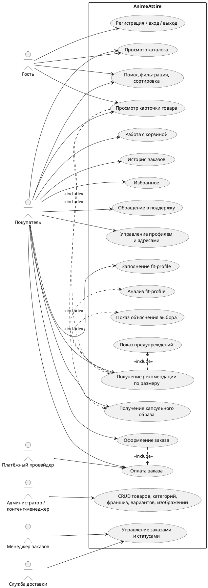

### 19.2. User Flow / Customer Journey

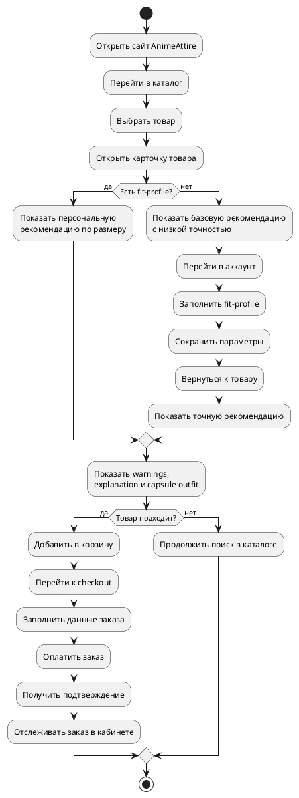

### 19.3. BPMN-подобная диаграмма процесса покупки

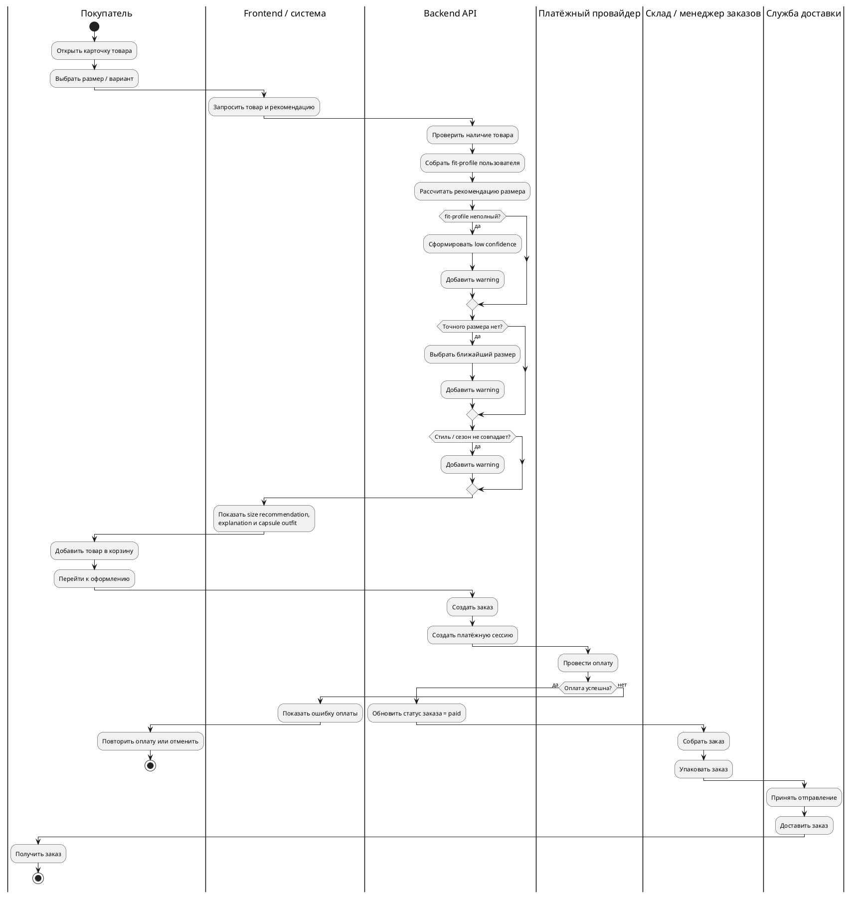

### 19.4. DFD Context Diagram (Level 0)

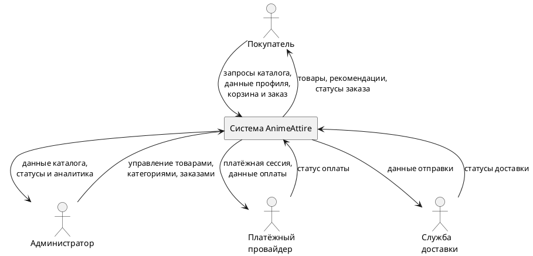

### 19.5. DFD Level 1

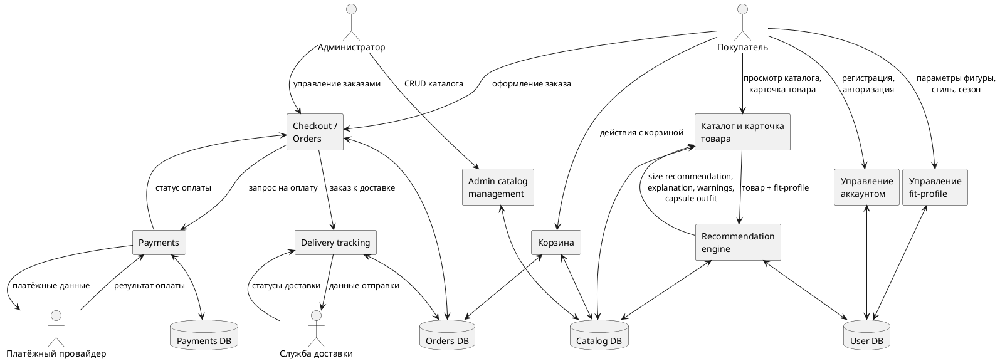

### 19.6. ERD

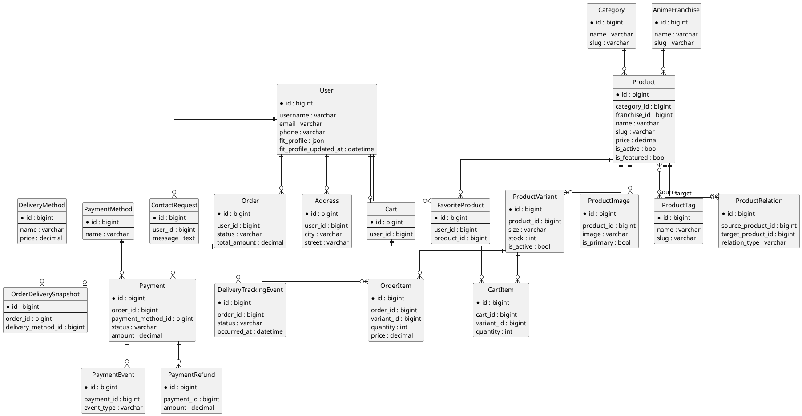

### 19.7. Sequence Diagram: заполнение fit-profile

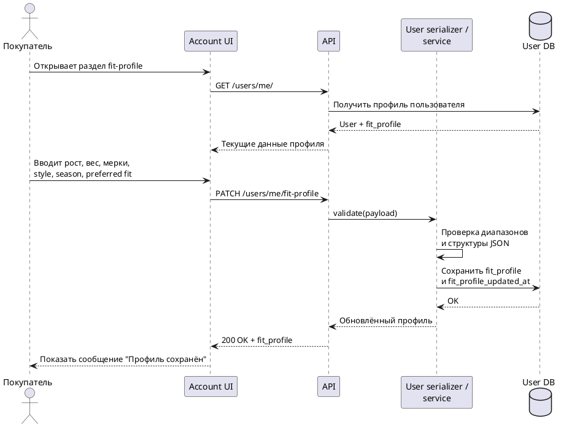

### 19.8. Sequence Diagram: recommendation в карточке товара

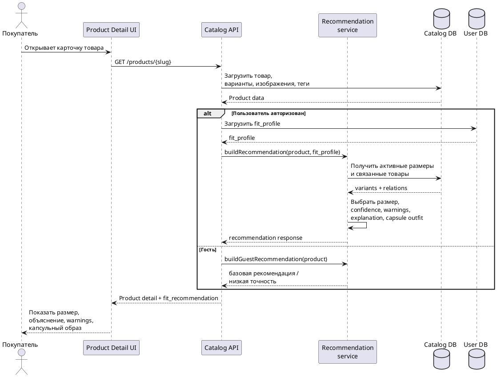

### 19.9. Sequence Diagram: checkout

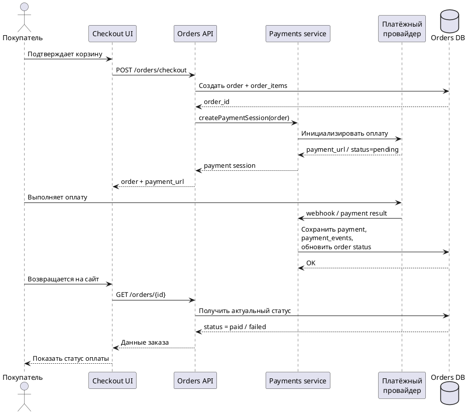

### 19.10. Component Diagram

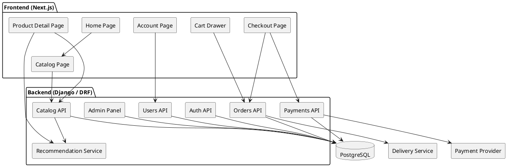

### 19.11. Deployment Diagram

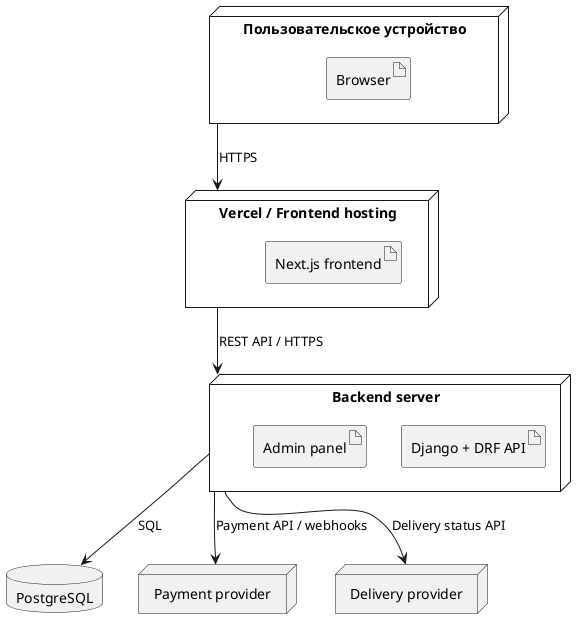

### 19.12. State Machine Diagram: заказ

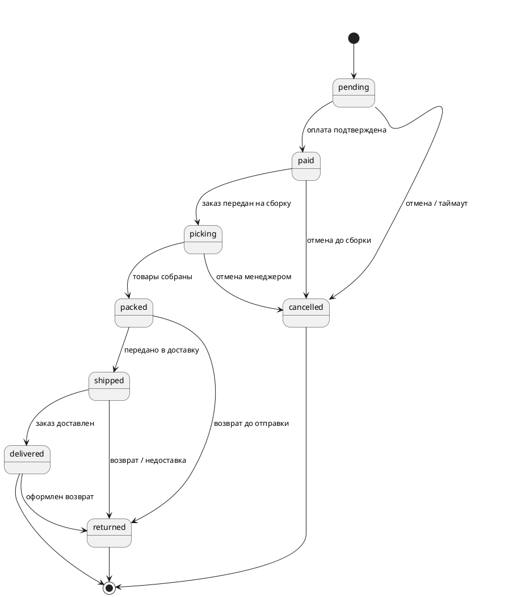

### 19.13. Activity Diagram: алгоритм рекомендации размера

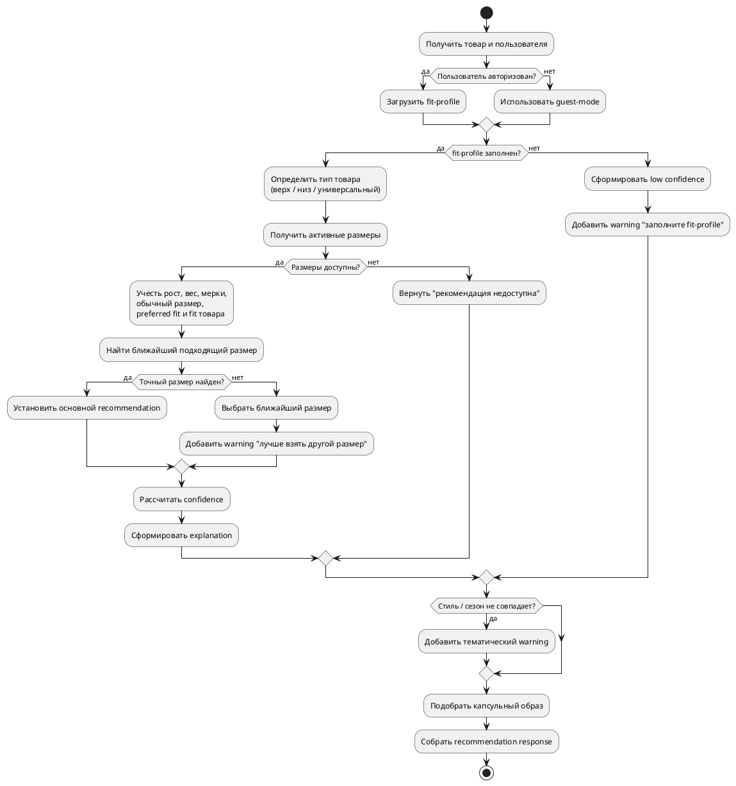

### 19.14. Activity Diagram: подбор капсульного образа

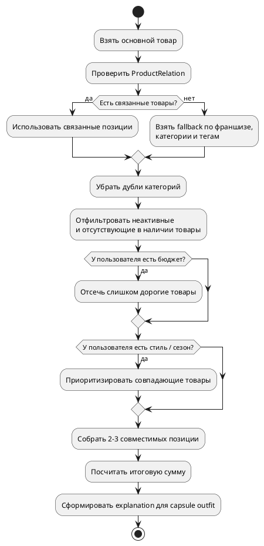

### 19.15. Sitemap / структура экранов

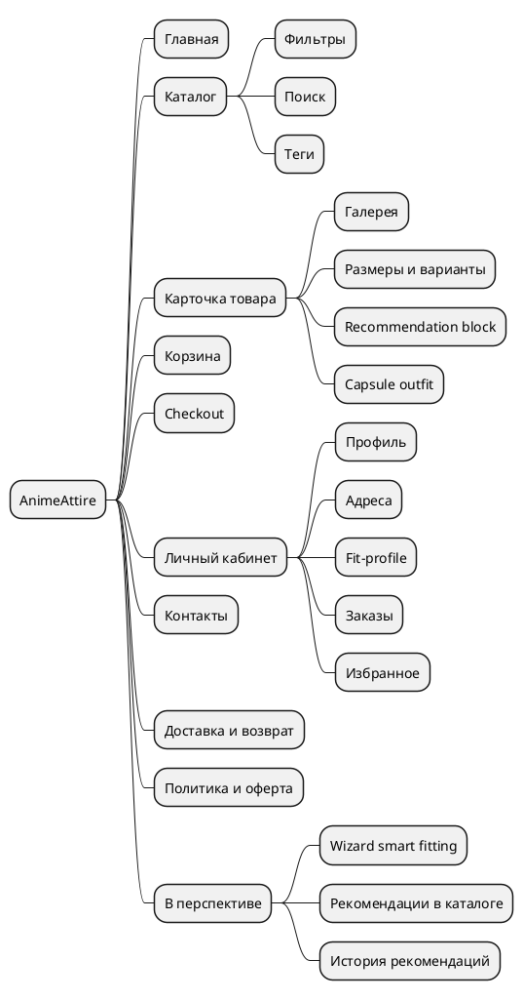
