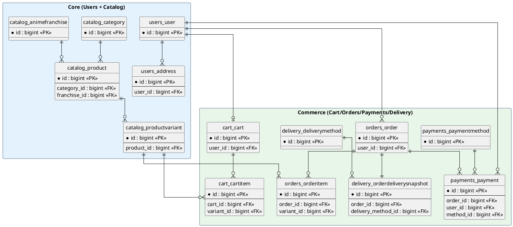

# 2.6. Проектирование базы данных

База данных интернет-магазина `AnimeAttire` спроектирована как реляционная структура, обеспечивающая хранение данных о пользователях, каталоге, корзине, заказах, оплатах и доставке.

В качестве СУБД используется `PostgreSQL`, что позволяет применять внешние ключи, ограничения уникальности, индексы и транзакционную обработку критически важных операций.

Структура приведена к **третьей нормальной форме (3НФ)**:

— каждая таблица описывает одну сущность или один устойчивый бизнес‑процесс;  
— все неключевые поля функционально зависят только от первичного ключа;  
— отсутствуют транзитивные зависимости (неключевой атрибут не зависит от другого неключевого атрибута).

Ниже представлена спроектированная ER‑модель базы данных, приведённая к 3НФ и отражающая основной поток интернет‑магазина: **каталог → корзина → заказ → оплата → доставка**.

Ключевые сущности:

— `users_user`, `users_address` — пользователь и его адреса доставки;  
— `catalog_category`, `catalog_animefranchise`, `catalog_product`, `catalog_productvariant` — каталог (категория/франшиза, товар и его варианты);  
— `cart_cart`, `cart_cartitem` — корзина и позиции корзины;  
— `orders_order`, `orders_orderitem` — заказ и состав заказа;  
— `payments_paymentmethod`, `payments_payment` — способы и факты оплат;  
— `delivery_deliverymethod`, `delivery_orderdeliverysnapshot` — способы доставки и снимок доставки, зафиксированный для заказа.

### Конвенция именования таблиц

Имена таблиц выбраны по конвенции **`<app_label>_<model>`**, принятой в Django: префикс приложения (контекст/подсистема) + имя модели (сущность). Это даёт:

— **группировку по доменам** (`users_*`, `catalog_*`, `orders_*` и т. д.);  
— **устойчивые, предсказуемые имена**, которые совпадают с ORM и админ‑частью (например, `admin:catalog_productvariant_*`);  
— **отсутствие коллизий** для одинаковых сущностей в разных модулях (например, условные `status`, `method`, `item`).

Для чтения в тексте отчёта ниже можно воспринимать имена как «простые» аналоги (логические названия в скобках):

— `users_user` (user), `users_address` (address);  
— `catalog_category` (category), `catalog_animefranchise` (franchise), `catalog_product` (product), `catalog_productvariant` (product_variant);  
— `cart_cart` (cart), `cart_cartitem` (cart_item);  
— `orders_order` (order), `orders_orderitem` (order_item);  
— `payments_paymentmethod` (payment_method), `payments_payment` (payment);  
— `delivery_deliverymethod` (delivery_method), `delivery_orderdeliverysnapshot` (order_delivery_snapshot).

Физическая ER‑диаграмма базы данных (3НФ) для сокращённого набора таблиц представлена на рисунке 2.5. На диаграмме для каждой таблицы показан первичный ключ и ключевые внешние ключи (поля вида `*_id`).

Словарь данных базы данных приведён ниже.

## 2.6.1. Словарь данных

### Таблица `users_user`

| Поле | Тип данных | Ключ (PK/FK/U) | Перевод поля | Обязательное |
|---|---|---|---|---|
| id | bigint | PK | идентификатор пользователя | да |
| username | varchar | U | логин пользователя | да |
| email | varchar |  | электронная почта | да |
| phone | varchar |  | номер телефона | да |
| created_at | timestamp |  | дата создания | да |
| updated_at | timestamp |  | дата обновления | да |

### Таблица `users_address`

| Поле | Тип данных | Ключ (PK/FK/U) | Перевод поля | Обязательное |
|---|---|---|---|---|
| id | bigint | PK | идентификатор адреса | да |
| user_id | bigint | FK | идентификатор пользователя | да |
| recipient_name | varchar |  | имя получателя | да |
| phone | varchar |  | телефон получателя | да |
| country | varchar |  | страна | да |
| city | varchar |  | город | да |
| postal_code | varchar |  | почтовый индекс | да |
| line1 | varchar |  | адрес (строка 1) | да |
| line2 | varchar |  | адрес (строка 2) | нет |
| created_at | timestamp |  | дата создания | да |
| updated_at | timestamp |  | дата обновления | да |

### Таблица `catalog_category`

| Поле | Тип данных | Ключ (PK/FK/U) | Перевод поля | Обязательное |
|---|---|---|---|---|
| id | bigint | PK | идентификатор категории | да |
| name | varchar |  | название категории | да |
| slug | varchar | U | человекочитаемый идентификатор | да |
| is_active | boolean |  | активна ли категория | да |
| created_at | timestamp |  | дата создания | да |
| updated_at | timestamp |  | дата обновления | да |

### Таблица `catalog_animefranchise`

| Поле | Тип данных | Ключ (PK/FK/U) | Перевод поля | Обязательное |
|---|---|---|---|---|
| id | bigint | PK | идентификатор франшизы | да |
| name | varchar |  | название франшизы | да |
| slug | varchar | U | человекочитаемый идентификатор | да |
| is_active | boolean |  | активна ли франшиза | да |
| created_at | timestamp |  | дата создания | да |
| updated_at | timestamp |  | дата обновления | да |

### Таблица `catalog_product`

| Поле | Тип данных | Ключ (PK/FK/U) | Перевод поля | Обязательное |
|---|---|---|---|---|
| id | bigint | PK | идентификатор товара | да |
| category_id | bigint | FK | идентификатор категории | да |
| franchise_id | bigint | FK | идентификатор франшизы | да |
| name | varchar |  | название товара | да |
| slug | varchar | U | человекочитаемый идентификатор | да |
| description | text |  | описание товара | да |
| base_price | numeric |  | базовая цена | да |
| currency | varchar |  | валюта | да |
| status | varchar |  | статус публикации | да |
| created_at | timestamp |  | дата создания | да |
| updated_at | timestamp |  | дата обновления | да |

### Таблица `catalog_productvariant`

| Поле | Тип данных | Ключ (PK/FK/U) | Перевод поля | Обязательное |
|---|---|---|---|---|
| id | bigint | PK | идентификатор варианта товара | да |
| product_id | bigint | FK | идентификатор товара | да |
| sku | varchar | U | артикул (SKU) | да |
| size | varchar |  | размер | да |
| color | varchar |  | цвет | да |
| stock_quantity | integer |  | остаток на складе | да |
| created_at | timestamp |  | дата создания | да |
| updated_at | timestamp |  | дата обновления | да |

### Таблица `cart_cart`

| Поле | Тип данных | Ключ (PK/FK/U) | Перевод поля | Обязательное |
|---|---|---|---|---|
| id | bigint | PK | идентификатор корзины | да |
| user_id | bigint | FK | идентификатор пользователя | да |
| session_key | varchar |  | ключ гостевой сессии | нет |
| created_at | timestamp |  | дата создания | да |
| updated_at | timestamp |  | дата обновления | да |

### Таблица `cart_cartitem`

| Поле | Тип данных | Ключ (PK/FK/U) | Перевод поля | Обязательное |
|---|---|---|---|---|
| id | bigint | PK | идентификатор позиции корзины | да |
| cart_id | bigint | FK | идентификатор корзины | да |
| variant_id | bigint | FK | идентификатор варианта товара | да |
| quantity | integer |  | количество | да |
| created_at | timestamp |  | дата создания | да |
| updated_at | timestamp |  | дата обновления | да |

### Таблица `orders_order`

| Поле | Тип данных | Ключ (PK/FK/U) | Перевод поля | Обязательное |
|---|---|---|---|---|
| id | bigint | PK | идентификатор заказа | да |
| user_id | bigint | FK | идентификатор пользователя | да |
| currency | varchar |  | валюта заказа | да |
| items_subtotal_amount | numeric |  | сумма товаров (без скидок и доставки) | да |
| discount_amount | numeric |  | сумма скидки | да |
| delivery_amount | numeric |  | стоимость доставки | да |
| total_amount | numeric |  | итоговая сумма | да |
| status | varchar |  | статус заказа | да |
| created_at | timestamp |  | дата создания | да |
| updated_at | timestamp |  | дата обновления | да |

### Таблица `orders_orderitem`

| Поле | Тип данных | Ключ (PK/FK/U) | Перевод поля | Обязательное |
|---|---|---|---|---|
| id | bigint | PK | идентификатор позиции заказа | да |
| order_id | bigint | FK | идентификатор заказа | да |
| variant_id | bigint | FK | идентификатор варианта товара | да |
| product_name | varchar |  | название товара (снимок) | да |
| sku | varchar |  | артикул (SKU) (снимок) | да |
| size | varchar |  | размер (снимок) | да |
| color | varchar |  | цвет (снимок) | да |
| quantity | integer |  | количество | да |
| price_at_purchase | numeric |  | цена на момент покупки | да |

### Таблица `payments_paymentmethod`

| Поле | Тип данных | Ключ (PK/FK/U) | Перевод поля | Обязательное |
|---|---|---|---|---|
| id | bigint | PK | идентификатор способа оплаты | да |
| code | varchar | U | код способа оплаты | да |
| name | varchar |  | название способа оплаты | да |
| is_active | boolean |  | активен ли способ оплаты | да |
| created_at | timestamp |  | дата создания | да |
| updated_at | timestamp |  | дата обновления | да |

### Таблица `payments_payment`

| Поле | Тип данных | Ключ (PK/FK/U) | Перевод поля | Обязательное |
|---|---|---|---|---|
| id | bigint | PK | идентификатор оплаты | да |
| order_id | bigint | FK | идентификатор заказа | да |
| user_id | bigint | FK | идентификатор пользователя | да |
| method_id | bigint | FK | идентификатор способа оплаты | да |
| status | varchar |  | статус оплаты | да |
| amount | numeric |  | сумма оплаты | да |
| currency | varchar |  | валюта | да |
| idempotency_key | varchar | U | ключ идемпотентности | да |
| created_at | timestamp |  | дата создания | да |
| updated_at | timestamp |  | дата обновления | да |

### Таблица `delivery_deliverymethod`

| Поле | Тип данных | Ключ (PK/FK/U) | Перевод поля | Обязательное |
|---|---|---|---|---|
| id | bigint | PK | идентификатор способа доставки | да |
| code | varchar | U | код способа доставки | да |
| name | varchar |  | название способа доставки | да |
| kind | varchar |  | тип доставки | да |
| price_amount | numeric |  | стоимость доставки | да |
| currency | varchar |  | валюта | да |
| estimated_days_min | integer |  | срок доставки (мин) | да |
| estimated_days_max | integer |  | срок доставки (макс) | да |
| is_active | boolean |  | активен ли способ доставки | да |
| sort_order | integer |  | порядок вывода | да |
| created_at | timestamp |  | дата создания | да |
| updated_at | timestamp |  | дата обновления | да |

### Таблица `delivery_orderdeliverysnapshot`

Таблица названа как `order + delivery + snapshot`, потому что хранит **«снимок» параметров доставки, закреплённый за конкретным заказом** (чтобы изменения в справочнике `delivery_deliverymethod` не меняли уже оформленные заказы).

| Поле | Тип данных | Ключ (PK/FK/U) | Перевод поля | Обязательное |
|---|---|---|---|---|
| id | bigint | PK | идентификатор снимка доставки | да |
| order_id | bigint | FK | идентификатор заказа | да |
| delivery_method_id | bigint | FK | идентификатор способа доставки | да |
| method_name | varchar |  | название способа доставки (снимок) | да |
| method_kind | varchar |  | тип способа доставки (снимок) | да |
| price_amount | numeric |  | стоимость доставки (снимок) | да |
| currency | varchar |  | валюта (снимок) | да |
| estimated_days_min | integer |  | срок доставки (мин) (снимок) | да |
| estimated_days_max | integer |  | срок доставки (макс) (снимок) | да |
| tracking_status | varchar |  | статус доставки | да |
| recipient_name | varchar |  | имя получателя | да |
| recipient_phone | varchar |  | телефон получателя | да |
| country | varchar |  | страна | да |
| city | varchar |  | город | да |
| postal_code | varchar |  | почтовый индекс | да |
| line1 | varchar |  | адрес (строка 1) | да |
| line2 | varchar |  | адрес (строка 2) | нет |
| created_at | timestamp |  | дата создания | да |

## 2.6.2. Итог по проектированию базы данных

В результате была спроектирована реляционная база данных интернет‑магазина `AnimeAttire`, приведённая к третьей нормальной форме. Разделение данных по сущностям позволяет избежать дублирования информации, упростить сопровождение системы и обеспечить корректную реализацию бизнес‑процессов: ведение каталога, управление корзиной, оформление заказов, проведение оплат и сопровождение доставки.

Сокращённая модель из 14 таблиц может использоваться как наглядная основа для описания структуры БД в отчёте; при развитии проекта она дополняется прикладными таблицами (скидки/промо, уведомления, аудит, складские операции и пр.) без нарушения принципов нормализации.

## СПИСОК ИСПОЛЬЗОВАННЫХ ИСТОЧНИКОВ

1.	СПбПУ Петра Великого. Официальный сайт университета. — URL: https://www.spbstu.ru/ (Дата обращения: 01.04.2026)
2.	Институт среднего профессионального образования СПбПУ. Официальная страница института. — URL: https://www.spbstu.ru/university/structure/institutes/secondary-vocational-education/ (Дата обращения: 03.04.2026)
3.	«Экспресс расписание колледж». Описание программного продукта. — URL: https://pbprog.ru/catalog/all/376 (Дата обращения: 05.04.2026)
4.	ГОСТ 34.602-2020. Информационная технология. Комплекс стандартов на автоматизированные системы. Техническое задание на создание автоматизированной системы. — М.: Стандартинформ, 2021. — 18 с.
5.	Соммервилл И. Инженерия программного обеспечения. — 10-е изд. — М.: Вильямс, 2021. — 736 с.
6.	Леффингуэлл Д., Видриг Д. Управление требованиями к программному обеспечению. — М.: Вильямс, 2021. — 432 с.
7.	ISO/IEC/IEEE 29148:2018. Systems and software engineering — Life cycle processes — Requirements engineering. — Geneva: International Organization for Standardization, 2018.
8.	ISO/IEC 25010:2023. Systems and software engineering — Systems and software Quality Requirements and Evaluation (SQuaRE) — Product quality model. — Geneva: International Organization for Standardization, 2023.
9.	Ричардсон Л., Руби С. RESTful Web APIs. — М.: Вильямс, 2021. — 288 с.
10.	OpenAPI Initiative. OpenAPI Specification. — URL: https://spec.openapis.org/oas/latest.html (Дата обращения: 08.04.2026)
11.	Swagger. Swagger UI Documentation. — URL: https://swagger.io/tools/swagger-ui/ (Дата обращения: 20.04.2026)
12.	The Go Authors. Go Documentation. — URL: https://go.dev/doc/ (Дата обращения: 10.04.2026)
13.	PostgreSQL Global Development Group. PostgreSQL Documentation. — URL: https://www.postgresql.org/docs/ (Дата обращения: 12.04.2026)
14.	OWASP Foundation. OWASP Top 10:2021. — URL: https://owasp.org/Top10/ (Дата обращения: 03.05.2026)
15.	Gin Web Framework. Documentation. — URL: https://gin-gonic.com/docs/ (Дата обращения: 14.04.2026)
16.	GORM. The fantastic ORM library for Golang. Documentation. — URL: https://gorm.io/docs/ (Дата обращения: 16.04.2026)
17.	Pressly. Goose migrations. Documentation. — URL: https://github.com/pressly/goose (Дата обращения: 18.04.2026)
18.	Макконнелл С. Совершенный код. Мастер-класс. — 2-е изд. — М.: Русская редакция, 2021. — 896 с.
